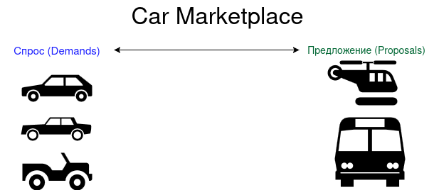

Площадка по продаже и покупке автомобилей -- это площадка, на которой пользователи выставляют предложения и потребности по продаже и покупке автомобилей. Задача
площадки -- предоставить наиболее подходящие варианты в обоих случаях: для предложения -- набор вариантов с
потребностями, для потребностей -- набор вариантов с предложениями.

## Визуальная схема фронтенда

## Документация

1. Маркетинг и аналитика
   1. [Целевая аудитория](./docs/01-biz/01-target-audience.md)
   2. [Заинтересанты](./docs/01-biz/02-stakeholders.md)
   3. [Пользовательские истории](./docs/01-biz/03-bizreq.md)
2. Аналитика:
   1. [Функциональные требования](./docs/02-analysis/01-functional-requiremens.md)
   2. [Нефункциональные требования](./docs/02-analysis/02-nonfunctional-requirements.md)
3. Архитектура
   1. [Описание API](docs/03-architecture/02-api.md)
   2. [Архитектурные схемы](docs/03-architecture/03-arch.md)

# Структура проекта

## Подпроекты для занятий по языку Kotlin

1. Модуль 1: Введение в Kotlin
   1. [m1l1-hw](lessons/m1l1-hw) - Вводное занятие, создание первой программы на Kotlin
   2. [m1l2-basic](lessons/m1l2-basic) - Основные конструкции Kotlin
2. Модуль 2: Расширенные возможности Kotlin
   4. [m2l4-kmp](lessons/m2l4-kmp) - Мультиплатформенная разработка
3. Модуль 3: Подготовка к разработке

### Плагины Gradle сборки проекта

1. [build-plugin](build-plugin) Модуль с плагинами
2. [BuildPluginJvm](build-plugin/src/main/kotlin/BuildPluginJvm.kt) Плагин для сборки проектов JVM
2. [BuildPluginMultiplarform](build-plugin/src/main/kotlin/BuildPluginMultiplatform.kt) Плагин для сборки
   мультиплатформенных проектов

## Проектные модули

### Транспортные модели, API